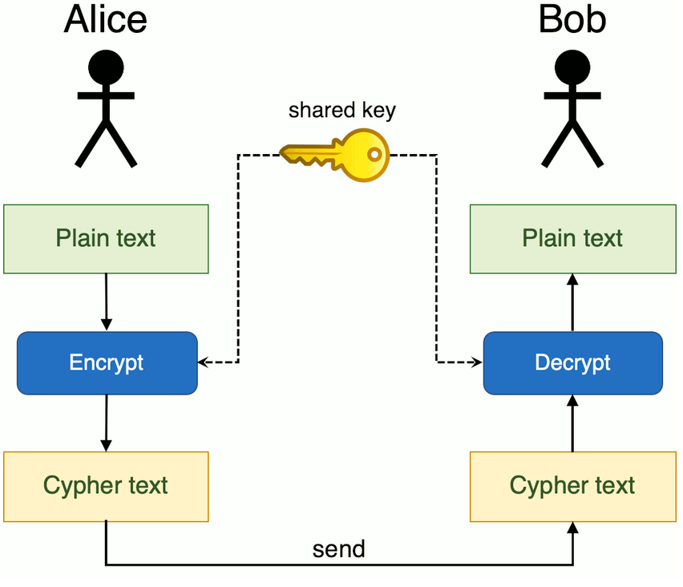
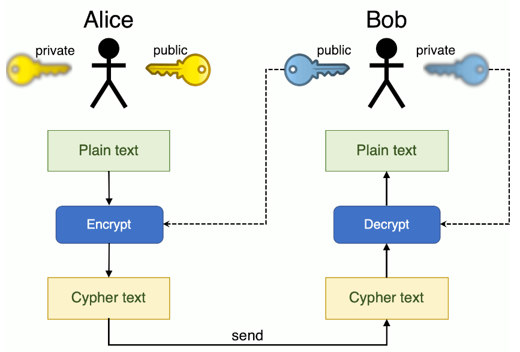

= The First Asciidoc example: Subtitle
:sectnums:
:toc: left
:toclevels: 4
:toc-title: SSH (Secure shell) protocol là gì

== SSH tools

* SSH - Secure shell là một công cụ và phương thức phổ biến nhất được sử dụng để remote server. SSH sẽ cung cấp các cơ chế thiết lập kết nối giữa 2 bên 1 cách an toàn và bảo mật.

* Thông thường và đặc biệt là trong lĩnh vực IT. Chúng ta sử dụng SSH như một công cụ cơ bản và cần thiết cho việc truy cập, remote,....
vậy đi sâu bên trong tools đó, nó làm gì?

.Cấu trúc SSH tools

giao thức SSH hoạt động dựa trên 3 lớp: transport, authentication and connection layer

Sơ đồ dưới đây mô tả đơn giản về cấu trúc của ssh

[ditaa]
----
+--------------------+
+ ssh connection     +
+--------------------+
+ ssh userauthen     +
+--------------------+
+ ssh transport      +
+--------------------+
+       TCP          +
+--------------------+
+       IP           +
+--------------------+
----

.Mô hình hoạt động:

. SSH Connection: Kết nối được thực hiện thông qua giao thức xác thực người dùng. Nó ghép nhiều kênh được mã hóa đồng thời khác nhau thành các kênh logic qua kết nối đã được xác thực. Cho phép tạo đường hầm các phiên đăng nhập và chuyển tiếp qua TCP. Cung cấp các dịch vụ kiểm soát luồng qua các kênh. Lớp này quản lí phiên SSH, ghép kênh phiên, chuyển tiếp X11, chuyển tiếp TCP, Shell, thực thi chương trình từ xa ...

. SSH Authentication: Thực hiện chứng thực người dùng. Thường được sử dụng để thiết lập các kết nối đến transport layer và cung cấp nhiều cơ chế khác nhau để chứng thực người dùng bao gồm các cơ chế chứng thực mật khẩu, public key, host base và hallenge-response, PAM (pluggable authentication modules), Generic Security Services API (GSSAPI) ...

. SSH Trans: cung cấp các chứng thực server, tính bảo mật và toàn vẹn data qua TCP thông qua các thuật toán và key-exchanges.

.Tóm tắt trình tự thiết lập kết nối giữa client và server sử dụng giao thức ssh
[plantuml, ssh protocol, png]

....
@startuml

Server <- Client : Khởi tạo kết nối đến server
Server --> Client : Send server public key

Server --> Client : Thực hiện quá trình đàm phán và mở kênh bảo mật
Server <- Client : Cho phép đăng nhập vào server: (username & password)

@enduml
....

.Bảo mật trong SSH

có 3 dạng mã hóa cơ bản trong SSH

. Mã hóa đối xứng
. Mã hóa bất đối xứng
. Hashing
--

. Mã hóa đối xứng

.. Mã hóa đối xứng là gì trong ssh?

- Mã hóa đối xứng là một dạng của mã hóa khi mà các secret key được thực hiện cho việc mã hóa và giải mã 1 messages (mình tạm gọi là gói tin dù không chính xác) trên cả client và server (có thể gọi là mã hóa 2 chiều) một cách hiệu quả hơn. Bất kì ai sở hữu key đều có thể giải mã message được chuyển đi.

- Mã hóa đối xứng còn được gọi là `shared key` và `share secret key`. Thường thì sẽ chỉ có 1 key được dùng. Trong một vài trường hợp thì 1 key có thể được dùng để tính toán và sử dụng key khác. Cả client và server sẽ tạo ra 1 secret key. Quá trình tạo ra secret key này được thực hiện bởi `key exchange algorithm`.

.. Mã hóa này có an toàn không ?

- Vì key không được truyền giữa client và server mà thay vào đó được tạo ra bằng thuật toán, cho nên nếu có 1 máy khác capture được gói tin thì cũng sẽ không thể tính toán để phân tách key vì chúng không biết được thuật toán tạo ra key. Tuy nhiên, các secret token chỉ được sử dụng cho 1 phiên ssh nhất định. Khi key đã được tạo, tất cả các gói tin được truyền giữa 2 máy phải được mã hóa kể cả khi login bằng username và pasword do user điền vào.

- Một số dạng mã hóa đối xứng phổ biến như là: AES (Advanced Encryption Standard), CAST128, Blowfish ...

.Mã hóa không đối xứng

.. Mã hóa đối xứng ?

- Không giống như mã hóa đối xứng, mã hóa không đối xứng sẽ sử dụng 2 key khác nhau để mã hóa và giải mã được gọi là public key và private key.

- Public key sẽ được công khai cho tất cả các bên liên quan. Mặc dù có liên quan mật thiết với private key về chức năng nhưng private key không thể tính toán được từ public key.

- Không giống với khái niệm thông thường, "mã hóa không đối xưng" không được dùng để mã hóa toàn bộ phiên SSH. Thay vào đó, nó chỉ được sử dụng trong quá trình trao đổi thuật toán của khóa của "mã hóa đối xứng". trước khi bắt đầu một phiên giao dịch an toàn, cả 2 đồng ý tạo ra một cặp public-private key tạm, chia sẽ private keys để tạo một khóa secret key chung.

.. Mức độ an toàn.

- Khi symmetrict kết nối an toàn đã được thiết lập, server sử dụng public key của client để tạo, thực thi và truyền nó tới client để chứng thực. Nếu client có thể giải mã tin nhắn, có nghĩa là nó đang giữa đúng private key cần thiết cho kết nối. Phiên giao dịch SSH bắt đầu.

.Hashing

- Hashing một chiều là 1 dạng mã hóa khác sử dụng trong ssh và khác với 2 phương thức mã hóa trên ở chỗ chúng không được tạo ra để giải mã. Chúng tạo ra 1 giá trị duy nhất với độ dài nhất định cho mỗi lần nhập liệu mà không có hướng nào khác để khai thác.

- SSH sử dụng hashes để xác nhận tính xác thực của tin nhắn. Nó được thực hiện bởi HMACs, hoặc Hash-based Message Authentication Codes. Việc này đảm bảo lệnh không bị giả mạo bởi bất kỳ phương thức nào.

--

== Cơ chế hoạt động

.. Các bước cơ bản:
- Có 2 giai đoạn để thiết lập kết nối ssh:
** Thiết lập các thỏa thuận chuẩn mã hóa để bảo vệ giao tiếp.
** Xác thực người dùng.

.. Cơ chế

... Tóm tắt nội dụng
- Tạo TCP/IP hanshake
- Thỏa thuận chuẩn thuật toán sử dụng
- Chứng thực người dùng
* Khi người dùng được cấp quyền truy cập server, hầu hết các ssh sẽ sử dụng username và password.

... Tóm tắt bằng sequence diagram

[plantuml, ssh sequence, png]
.....

@startuml

activate ssh_client
activate TCPIP
activate ssh_trans
activate ssh_authen
activate ssh_conn
activate ssh_server

ssh_client -> ssh_client: reading configuration
ssh_client -> TCPIP : TCP sync to port 22
ssh_client <- TCPIP : TCp sync ACK
ssh_client -> TCPIP : TCP ACK
ssh_client <- ssh_trans : Server ssh 2.0 software version
ssh_client -> TCPIP : TCP ACK (msg recvd)
ssh_client -> ssh_trans : Server ssh 2.0 software version
ssh_client <- TCPIP : TCP ACK (msg recvd)
ssh_client <- ssh_trans: Server key exchange inits
ssh_client <- ssh_client : Compare encryption and hashing algorithms that match with server's.
ssh_client <-> ssh_trans : diffie hellman key exchange
ssh_client -> ssh_trans: SSH2 MSG SERVICE REQUEST (ssh usrauth)
ssh_client <- TCPIP : TCP ACK (msg recvd)
ssh_client -> ssh_authen: SSH2_MSG_USERAUTH_REQUEST (username,ssh-userauth,"password",FALSE,password)
ssh_authen -> ssh_authen: hash of passwordcompared in /etc/shadow
ssh_client <- ssh_authen: SSH2_MSG_USERAUTH_SUCCESS
ssh_client -> ssh_conn: SSH_MSG_CHANNEL_OPEN
ssh_client <- ssh_conn: SSH_MSG_CHANNEL_OPEN_CONFIRMATION
ssh_client -> ssh_conn: SSH_MSG_CHANNEL_DATA (shell)
ssh_client -> ssh_server: execute shell
ssh_cleint <- ssh_server: SSH_MSG_CHANNEL_DATA (shell)

@enduml
....

reference:
https://www.hostinger.com/tutorials/ssh-tutorial-how-does-ssh-work
https://en.wikibooks.org/wiki/OpenSSH/SSH_Protocols
